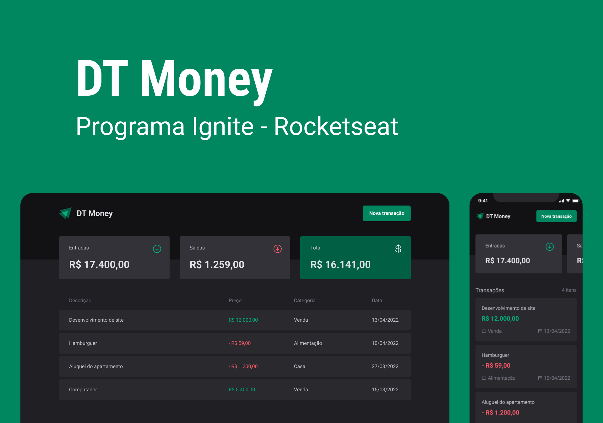

<br>

## Index 

[About](#about)

[Technologies](#technologies)

[How to use](#how-to-use)

[License](#license)

<br>

## About


It is a simple and effective alternative for managing your finances, allowing you to register inputs, outputs and organize them into categories.

<br>

<p align="center">
  
</p>

## Technologies

Technologies and tools used for development this app:


- [Styled Components](https://styled-components.com/)
- [Json-Server](https://github.com/typicode/json-server)
- [Radix UI](https://www.radix-ui.com/)
- [Axios](https://github.com/axios/axios)
- [Phosphor Icons](https://phosphoricons.com/)
- [Zod](https://zod.dev/)

<br>

## How to Use

```bash
# Open a terminal and clone this repository with the command
git clone https://github.com/ldanielz/DT-Money.git
# or download it.

cd dt-money

# Dependencies install
npm install

# Run app
npm run dev

```

For simulator API requisitions, use JSON Server:
``` bash

# Run Json Server command: json-server server.json -w -d 500
npm run dev:server
# Server run in http://localhost:3000
```

<br>

---

Made by [Lizandro Daniel](https://github.com/ldanielz)

[](https://www.linkedin.com/in/ldanielzenteno/) 
